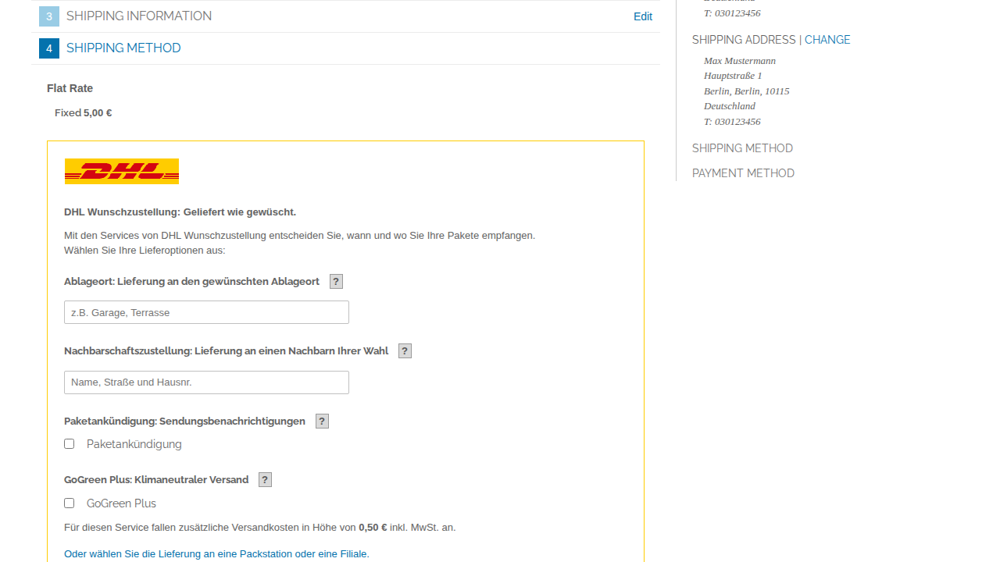
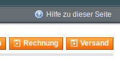
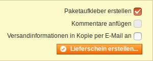
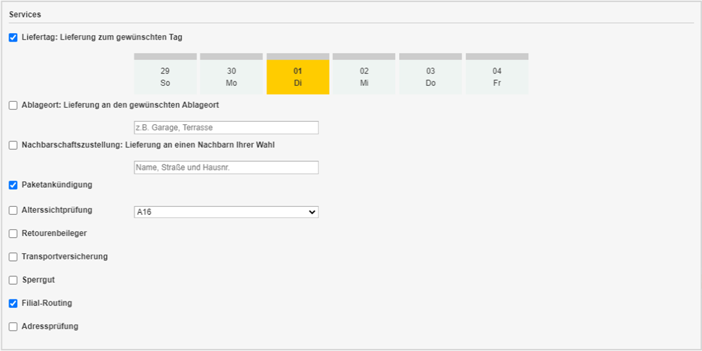
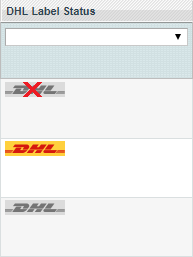
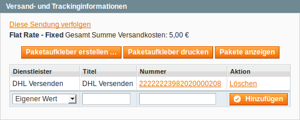
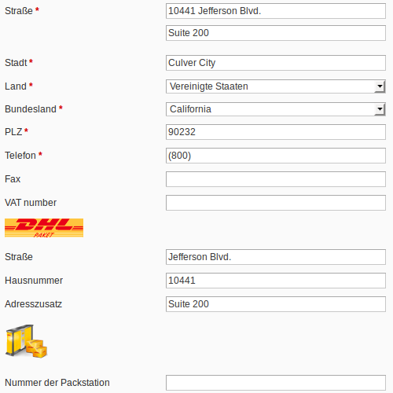

.. ,date, date:: %Y-%m-%d
.. ,year, date:: %Y

.. footer::
   .. class:: footertable

   +-------------------------+-------------------------+
   , Stand: ,date,           , .. class:: rightalign   ,
   ,                         ,                         ,
   ,                         , ###Page###/###Total###  ,
   +-------------------------+-------------------------+

.. header::
   .. image:: images/dhl.jpg
      :width: 4.5cm
      :height: 1.2cm
      :align: right

.. sectnum::

===================================================
DHL Versenden: Paketversand für DHL Geschäftskunden
===================================================

Das Modul *DHL Versenden* für Magento® ermöglicht es Händlern mit einem
DHL Geschäftskundenkonto, Sendungen über die DHL Geschäftskundenversand API
anzulegen und Versandscheine (Paketaufkleber) abzurufen. Die Extension
ermöglicht dabei auch das Hinzubuchen von Zusatzleistungen sowie den Abruf von
Exportdokumenten für den internationalen Versand.

.. raw:: pdf

   PageBreak

.. contents:: Endbenutzer-Dokumentation

.. raw:: pdf

   PageBreak

Voraussetzungen
===============

Die nachfolgenden Voraussetzungen müssen für den reibungslosen Betrieb des Moduls erfüllt sein:

Magento®
--------

Folgende Magento®-Versionen werden vom Modul unterstützt:

- Community Edition 1.9
- Community Edition 1.8
- Community Edition 1.7

PHP
---

Folgende PHP-Versionen werden vom Modul unterstützt:

- PHP 7.0
- PHP 5.6
- PHP 5.5

Für die Anbindung des DHL Webservice muss die PHP SOAP Erweiterung auf dem
Webserver installiert und aktiviert sein.

Hinweise zur Verwendung des Moduls
==================================

Versandursprung und Währung
---------------------------

Die Extension *DHL Versenden* für Magento® wendet sich an Händler mit Sitz in
Deutschland oder Österreich. Stellen Sie sicher, dass Ihre Absenderadressen in
den drei im Abschnitt Modulkonfiguration_ genannten Bereichen korrekt ist.

Die Basiswährung der Installation wird als Euro angenommen. Es findet keine
Konvertierung aus anderen Währungen statt.

Sprachunterstützung
-------------------

Das Modul unterstützt die Lokalisierungen ``en_US`` und ``de_DE``. Die Übersetzungen
sind in den CSV-Übersetzungsdateien gepflegt und somit auch durch Dritt-Module anpassbar.

Dritt-Modul Kompabilität
------------------------

Amazon Pay For Europe
~~~~~~~~~~~~~~~~~~~~~

Das Modul ist kompatibel mit der Extension *Creativestyle Amazon Pay For Europe* ab
Version **1.0.16**.

Damit die Adresse korrekt gespeichert wird, muss folgende Einstellung in der Konfiguration des Amazon Pay Moduls vorgenommen werden:

::

    System → Konfiguration → creativestyle → Amazon Pay →  Allgemeine Einstellungen →
    Login mit Amazon aktivieren → Ja

.. admonition:: Wichtig

   Diese Einstellung **muss aktiviert werden**, da ansonsten die Adressinformationen nicht
   korrekt gespeichert und später nicht an DHL gesendet werden können. Die Adresse müsste
   dann von Hand in der Bestellung nachgetragen werden.

.. raw:: pdf

   PageBreak

Installation und Konfiguration
==============================

Im Folgenden wird beschrieben, wie das Modul installiert wird und welche
Konfigurationseinstellungen vorgenommen werden müssen.

Installation
------------

Installieren Sie die Dateien gemäß Ihrer bevorzugten Installations- und
Deployment-Strategie. Aktualisieren Sie den Konfigurations-Cache, damit die
Änderungen wirksam werden.

Beim ersten Aufruf des Moduls werden diese neuen Adress-Attribute im System angelegt:

- ``dhl_versenden_info``

Die Attribute werden in folgenden Tabellen hinzugefügt:

- ``sales_flat_quote_address``
- ``sales_flat_order_address``

Modulkonfiguration
------------------

Für die Abwicklung von Versandaufträgen relevant sind drei Konfigurationsbereiche:

::

    System → Konfiguration → Allgemein → Allgemein → Store-Information
    System → Konfiguration → Verkäufe → Versandeinstellungen → Herkunft
    System → Konfiguration → Verkäufe → Versandarten → DHL Versenden

Stellen Sie sicher, dass die erforderlichen Felder aus den Bereichen
Store-Information und Herkunft ausgefüllt sind:

* Store-Information

  * Store-Name
  * Store-Kontakttelefon
* Herkunft

  * Land
  * Region/Bundesland
  * Postleitzahl
  * Stadt
  * Straße

Im Folgenden werden die Konfigurationsabschnitte für *DHL Versenden* beschrieben.

.. admonition:: Hinweis

   Die Abschnitte *Versandarten → DHL* und *Versandarten → DHL (veraltet)*
   sind Kernbestandteile von Magento® und binden die Schnittstelle von DHL USA an.
   Sie sind jedoch nicht relevant für den DHL Geschäftskundenversand (Versenden)
   in Deutschland bzw. Österreich. Aktivieren Sie diese Abschnitte nicht, wenn Sie
   *DHL Versenden* nutzen!

Allgemeine Einstellungen
~~~~~~~~~~~~~~~~~~~~~~~~

Im Konfigurationsbereich *Allgemeine Einstellungen* wird festgelegt, ob der
*Sandbox-Modus* zum Testen der Integration verwendet oder die
Extension produktiv betrieben werden soll.

Außerdem kann hier die Protokollierung konfiguriert werden. Wenn die Protokollierung
hier und unter *System → Konfiguration → Erweitert → Entwickleroptionen → Log
Einstellungen* aktiviert ist, werden Webservice-Nachrichten in der Datei
``var/log/dhl_versenden.log`` aufgezeichnet. Dabei haben Sie die Auswahl zwischen
drei Protokollstufen:

* ``Error`` zeichnet Fehler in der Kommunikation zwischen Shop und DHL Webservice auf.
* ``Warning`` zeichnet Kommunikationsfehler sowie Fehler, die auf den Inhalt der
  Nachrichten zurückgehen (z.B. Adressvalidierung, ungültige Service-Auswahl) auf.
* ``Debug`` zeichnet sämtliche Nachrichten, Fehler und übertragenen Inhalte auf.

.. admonition:: Hinweis

   Stellen Sie sicher, dass die Log-Dateien regelmäßig bereinigt bzw. rotiert werden.

Stammdaten
~~~~~~~~~~

Im Konfigurationsbereich *Stammdaten* werden Ihre Zugangsdaten für den DHL Webservice
hinterlegt, die für den Produktivmodus erforderlich sind. Die Zugangsdaten erhalten
DHL Vertragskunden über den Vertrieb DHL Paket.

Eine detaillierte Anleitung zur Einrichtung der Teilnahmenummern finden Sie in `diesem Artikel
in der Wissensdatenbank <http://dhl.support.netresearch.de/support/solutions/articles/12000024658>`_.

Versandaufträge
~~~~~~~~~~~~~~~

Im Konfigurationsbereich *Versandaufträge* werden Einstellungen vorgenommen, die
für die Erteilung von Versandaufträgen über den DHL Webservice erforderlich sind.

* *Nur leitkodierbare Versandaufträge erteilen*: Ist diese Einstellung aktiviert,
  wird DHL nur Sendungen akzeptieren, deren Adressen absolut korrekt sind. Ansonsten
  lehnt DHL die Sendung mit einer Fehlermeldung ab. Wenn diese Einstellung abgeschaltet
  ist, wird DHL versuchen, fehlerhafte Lieferadressen automatisch korrekt zuzuordnen,
  wofür ein Nachkodierungsentgelt erhoben wird. Wenn die Adresse überhaupt nicht
  zugeordnet werden kann, wird die Sendung dennoch abgelehnt.
* *Empfänger-Telefonnummer übertragen*: Hiermit kann gesteuert werden, ob die Telefonnummer
  des Käufers bei der Sendungserstellung an DHL übermittelt werden soll.
* *Gewichtseinheit*: Legen Sie fest, ob die Gewichtsangaben in Ihrem Katalog in
  Gramm oder Kilogramm gepflegt sind. Bei Bedarf wird das Gewicht während der
  Übertragung an DHL auf Kilogramm umgerechnet.
* *Versandarten für DHL Versenden*: Legen Sie fest, welche Versandarten mit DHL
  verknüpft sein sollen. Für die hier ausgewählten Versandarten werden im Checkout die
  verfügbaren DHL Zusatzleistungen angeboten und DHL-Label erzeugt, wenn der Lieferschein
  in Magento® angelegt wird.
* *Nachnahme-Zahlarten für DHL Versenden*: Legen Sie fest, bei welchen Zahlarten es sich
  um Nachnahme-Zahlarten handelt. Wenn eine dieser Zahlarten verwendet wird, wird ein
  Nachnahme-Label erzeugt.

.. raw:: pdf

   PageBreak

DHL Zusatzleistungen im Checkout
~~~~~~~~~~~~~~~~~~~~~~~~~~~~~~~~

Im Konfigurationsbereich *DHL Zusatzleistungen im Checkout* legen Sie fest,
welche im Rahmen des DHL Geschäftskundenversand zubuchbaren Services Ihren Kunden
angeboten werden.

* *Wunschort*: Der Kunde wählt einen alternativen Ablageort für seine Sendung,
  falls er nicht angetroffen wird.
* *Wunschnachbar*: Der Kunde wählt eine alternative Adresse in der Nachbarschaft
  für die Abgabe der Sendung, falls er nicht angetroffen wird.
* *Paketankündigung*: Der Kunde wird per E-Mail von DHL über den Status seiner
  Sendung informiert. Wählen Sie hier aus folgenden Optionen:

  * *Ja*: Der Service wird immer hinzugebucht.
  * *Optional*: Der Kunde bestimmt im Checkout, ob er den Service wünscht.
  * *Nein*: Der Service wird nie hinzugebucht.

* *Wunschtag*: Der Kunde wählt einen festgelegten Tag für seine Sendung,
  an welchem die Lieferung ankommen soll.
* *Wunschzeit*: Der Kunde wählt ein Zeitfenster für seine Sendung,
  in welchem die Lieferung ankommen soll.
* *Wunschtag / Wunschzeit Aufpreis (Serviceaufschlag)*: Dieser Betrag wird zu den Versandkosten
  hinzu addiert, wenn der Zusatzservice verwendet wird. Verwenden Sie Punkt statt Komma
  als Trennzeichen. Der Betrag muss in Brutto angegeben werden (einschl. Steuern).
  Wenn Sie die Zusatzkosten nicht an den Kunden weiterreichen wollen, tragen Sie hier
  ``0`` ein.
* *Wunschtag / Wunschzeit Serviceaufschlag Hinweistext*: Dieser Text wird dem Kunden
  im Checkout angezeigt, wenn der Zusatzservice ausgewählt wird. Sie können den
  Platzhalter ``$1`` im Text verwenden, welcher im Checkout durch den Zusatzbetrag
  und die Währung ersetzt wird.

**Achtung:** Die Services *Wunschtag* und *Wunschzeit* sind **standardmäßig aktiviert!**
Dadurch werden die von DHL vorgegebenen Service-Aufschläge zu den Versandkosten
hinzugefügt.

* *Annahmeschluss*: Legt den Zeitpunkt fest, bis zu dem eingegangene Bestellungen
  noch am selben Tag abgeschickt werden. Bestellungen, die *nach* Annahmeschluss
  eingehen, werden nicht mehr am selben Tag verschickt. Der früheste Wunschtag
  verschiebt sich dann um einen Tag.

.. admonition:: Zusatzkosten für Wunschtag / Wunschzeit

   Bei Nutzung der Versandart *Free Shipping / Versandkostenfrei* werden die eingestellten
   Zusatzkosten generell außer Kraft gesetzt!

Wenn die Versandart *Table Rates / Tabellenbasierte Versandkosten* genutzt wird und eine
Grenze für kostenlosen Versand festgelegt werden soll, empfehlen wir dazu eine
Warenkorbpreisregel einzurichten. Durch Nutzung dieser Versandart bleiben die Aufpreise
für Zusatzservices erhalten.

.. admonition:: Hinweis zu Annahmeschluss

   Für dieses Feature ist die Serverzeit Ihres Systems wichtig. Damit die Zeitschwelle
   korrekt funktioniert, muss die Serverzeit richtig gesetzt sein. Achten Sie auf eventuelle
   Verschiebungen durch Sommer- bzw. Winterzeit oder abweichende Zeitzonen. Setzen Sie
   wenn nötig eine andere Annahmeschluss-Zeit, um dies auszugleichen.

Automatische Sendungserstellung
~~~~~~~~~~~~~~~~~~~~~~~~~~~~~~~

Im Konfigurationsbereich *Automatische Sendungserstellung* legen Sie fest, ob
automatisch Lieferscheine erzeugt und Paketaufkleber abgerufen werden sollen (per Cronjob).

Die Einstellung *Kundenbenachrichtigung* ermöglicht es, die Versandinformationen per E-Mail
an den Kunden zu schicken, wenn Lieferschein und DHL-Auftrag erfolgreich erzeugt wurden.

Die Einstellung *Bestell-Status* legt fest, welchen Status eine Bestellung haben muss,
um durch die automatische Sendungserstellung berücksichtigt zu werden. Hierüber können Sie
steuern, welche Bestellungen von der automatischen Verarbeitung ausgeschlossen werden sollen.

Außerdem legen Sie hier die *Zusatzservices* fest, die automatisch hinzugebucht werden sollen.

Kontaktinformationen
~~~~~~~~~~~~~~~~~~~~

Im Konfigurationsbereich *Kontaktinformationen* legen Sie fest, welche Absenderdaten
während der Erstellung von Versandaufträgen an DHL übermittelt werden sollen.

Bankverbindung
~~~~~~~~~~~~~~

Im Konfigurationsbereich *Bankverbindung* legen Sie fest, welche Bankdaten im
Rahmen von Nachnahme-Versandaufträgen an DHL übermittelt werden.
Der vom Kunden erhobene Nachnahmebetrag wird auf dieses Konto transferiert.

Beachten Sie, dass die Bankverbindung ggf. auch in Ihrem DHL-Konto hinterlegt werden
muss. I.d.R. kann dies über das DHL Geschäftskundenportal erledigt werden.

Retourenbeileger
~~~~~~~~~~~~~~~~

Im Konfigurationsbereich *Retourenbeileger* legen Sie fest, welche Empfängeradresse
auf das Retoure-Label gedruckt werden soll, wenn dieser Service gebucht wird.

.. raw:: pdf

   PageBreak

Ablaufbeschreibung und Features
===============================

Annahme einer Bestellung
------------------------

Im Folgenden wird beschrieben, wie sich die Extension *DHL Versenden* in den
Bestellprozess integriert.

Checkout
~~~~~~~~

In der Modulkonfiguration_ wurden Versandarten gewählt, die über DHL abgewickelt
werden sollen.

Wählt der Kunde im Checkout-Schritt *Versandart* eine dieser Versandarten, werden
die in der Konfiguration aktivierten DHL-Zusatzleistungen angeboten.

Im Checkout-Schritt *Zahlungsinformation* werden Nachnahme-Zahlarten ausgeblendet,
falls der Nachnahme-Service für die gewählte Lieferadresse nicht zur Verfügung
steht.

Der Kunde kann auf den Link "*Oder wählen Sie die Lieferung an einen Paketshop oder
eine Postfiliale*" klicken. Dadurch wird er zum Schritt *Lieferadresse* zurück
geleitet und kann, wenn gewünscht, einen DHL-Abholort als abweichende Lieferadresse
eingeben.

Falls das Modul `DHL Locationfinder <http://dhl.support.netresearch.de/support/solutions/articles/12000016724>`_
installiert ist, kann der Kunde diesen nutzen, um mit wenig Aufwand naheliegende
DHL-Abholorte zu finden und zu übernehmen.

.. raw:: pdf

   PageBreak

Admin Order
~~~~~~~~~~~

Bei der Erzeugung von Bestellungen im Admin Panel stehen keine Zusatzleistungen
zur Verfügung. Es ist aber möglich, Zusatzleistungen zu wählen, wenn später die
Lieferung erstellt wird.

Nachnahme-Zahlarten werden ebenso wie im Checkout deaktiviert, falls
der Nachnahme-Service für die gewählte Lieferadresse nicht zur Verfügung steht.

DHL Lieferadressen (Packstationen, Postfilialen, Paket-Shops)
~~~~~~~~~~~~~~~~~~~~~~~~~~~~~~~~~~~~~~~~~~~~~~~~~~~~~~~~~~~~~

Die Extension *DHL Versenden* selbst bietet nur eine eingeschränkte Unterstützung
von DHL Lieferadressen im Checkout:

* Das Format *Packstation 123* im Feld *Straße* wird erkannt.
* Das Format *Postfiliale 123* im Feld *Straße* wird erkannt.
* Ein numerischer Wert im Feld *Firma* wird als Postnummer erkannt.

Eine umfassendere Unterstützung von DHL Lieferadressen im Zusammenspiel mit der
Erteilung von Versandaufträgen über den DHL Webservice bietet die separate
Extension `DHL Locationfinder <http://dhl.support.netresearch.de/support/solutions/articles/12000016724>`_:

* Interaktive Karte zur Auswahl der DHL Lieferadresse
* Gesonderte Eingabefelder für DHL-Daten im Checkout (z.B. Postnummer)
* Validierung der Kundeneingaben
* Unterstützung von Paket-Shops

Erstellen eines Versandauftrags
-------------------------------

Im Folgenden Abschnitt wird beschrieben, wie zu einer Bestellung ein Versandauftrag
erstellt und ein Paketaufkleber abgerufen wird.

Nationale Sendungen
~~~~~~~~~~~~~~~~~~~

Öffnen Sie im Admin Panel eine Bestellung, deren Versandart mit dem DHL
Geschäftskundenversand verknüpft ist (siehe Modulkonfiguration_, Abschnitt *Versandarten
für DHL Versenden*). Betätigen Sie dann den Button *Versand* oben rechts.

Es öffnet sich die Seite *Neuer Versand für Bestellung*. Aktivieren Sie die Checkbox
*Paketaufkleber erstellen* an und betätigen Sie den Button *Lieferschein erstellen...*.

Es öffnet sich nun ein Popup zur Definition der im Paket enthaltenen Artikel.
Betätigen Sie den Button *Artikel hinzufügen*, markieren Sie die bestellten
Produkte und bestätigen Sie Ihre Auswahl durch Klick auf
*Gewählte Artikel zum Paket hinzufügen*. Die Angabe der Paketmaße ist optional.

.. admonition:: Mehrpaket-Sendungen

   Die Aufteilung der Produkte in mehrere Pakete wird vom DHL Webservice
   derzeit nicht unterstützt. Erstellen Sie alternativ mehrere Lieferscheine
   (Teillieferung / Partial Shipment) zu einer Bestellung, siehe auch
   `diese Anleitung <http://dhl.support.netresearch.de/support/solutions/articles/12000029043>`_.

Der Button *OK* im Popup ist nun aktiviert. Bei Betätigung wird ein Versandauftrag
an DHL übermittelt und im Erfolgsfall der resultierende Paketaufkleber abgerufen.
Im Fehlerfall wird die vom Webservice erhaltene Fehlermeldung eingeblendet und
die Bestellung kann entsprechend korrigiert werden, siehe auch Fehlerbehandlung_.

Internationale Sendungen
~~~~~~~~~~~~~~~~~~~~~~~~

Bei Sendungen mit einer Lieferadresse außerhalb der EU werden zusätzliche Felder
im Popup zur Definition der im Paket enthaltenen Artikel eingeblendet. Geben
Sie für den Abruf der notwendigen Exportdokumente mindestens die Zolltarifnummern
sowie den Inhaltstyp der Sendung an.

Gehen Sie ansonsten wie im Abschnitt `Nationale Sendungen`_ beschrieben vor.

Service-Auswahl
~~~~~~~~~~~~~~~

Neben den im Checkout verfügbaren Zusatzleistungen, die sich an den Käufer richten,
stehen für den DHL Geschäftskundenversand weitere, an den Händler gerichtete
Services zur Verfügung. Die für die aktuelle Lieferadresse möglichen Zusatzleistungen
werden im Popup zur Definition der im Paket enthaltenen Artikel eingeblendet.

Die vom Kunden im Checkout gewählten Services sind entsprechend vorbelegt, ebenso
wie die *Adressprüfung* (Nur leitkodierbare Versandaufträge erteilen) gemäß der
Modulkonfiguration_.

Sollten Sie Wunschort oder Wunschnachbar bearbeiten oder hinzufügen wollen, beachten
Sie das Sonderzeichen oder Angaben wie Paketbox, Packstation, Postfach, Postfiliale,
Filiale, Postfiliale Direkt, Filiale Direkt, Paketkasten, DHL, P-A-C-K-S-T-A-T-I-O-N,
Paketstation, Pack Station, P.A.C.K.S.T.A.T.I.O.N., Pakcstation, Paackstation, Pakstation,
Backstation, Bakstation, P A C K S T A T I O N, Wunschfiliale, Deutsche Post
nicht zulässig sind.

.. raw:: pdf

   PageBreak

Massenaktion
~~~~~~~~~~~~

Inländische und EU-Lieferscheine und Paketaufkleber können über die Massenaktion
*Paketaufkleber abrufen* in der Bestellübersicht erzeugt werden:

* Verkäufe → Bestellungen → Massenaktion *Paketaufkleber abrufen*

Dies ermöglicht es, einfache Paketaufkleber ohne manuelle Eingaben zu erstellen.
Dabei gilt:

* Es werden alle in der Bestellung enthaltenen Artikel übernommen.
* Die im Checkout gewählten DHL-Zusatzleistungen werden übernommen.
* Weitere Zusatzleistungen, die im Bereich *Automatische Sendungserstellung* in der
  Modulkonfiguration_ eingestellt sind, werden hinzugebucht.

Übersicht der Versandaufträge
-----------------------------

Bei Bestellungen, die über DHL abgewickelt werden, erscheinen in der Bestellübersicht
DHL-Icons, die den Status der Versandaufträge zeigen.

* **Durchgestrichenes Icon**: es gab Fehler bei der Label-Erstellung, siehe Fehlerbehandlung_.
* **Gelbes Icon**: Übertragung ok, Label erfolgreich erstellt.
* **Graues Icon**: Übertragung an DHL wurde noch nicht ausgeführt.

.. raw:: pdf

   PageBreak

Drucken eines Paketaufklebers
-----------------------------

Bereits abgerufene Paketaufkleber können standardmäßig an verschiedenen
Stellen im Admin Panel eingesehen werden:

* Verkäufe → Bestellungen → Massenaktion *Paketaufkleber drucken*
* Verkäufe → Lieferscheine → Massenaktion *Paketaufkleber drucken*
* Detail-Ansicht eines Lieferscheins → Button *Paketaufkleber drucken*

Beachten Sie, dass hierüber keine *neuen* Aufträge an DHL übermittelt werden,
sondern lediglich die bereits in Magento® gespeicherten DHL-Label abgerufen werden.

Zur Erstellung von *neuen* DHL-Aufträgen und Labeln gehen Sie bitte wie unter
Massenaktion_ beschrieben vor.

Stornieren eines Versandauftrags
--------------------------------

Solange ein Versandauftrag nicht manifestiert ist, kann dieser über den DHL
Webservice storniert werden. Öffnen Sie dazu im Admin-Panel die Detail-Ansicht
eines Lieferscheins und betätigen Sie den Link *Löschen* in der Box
*Versand- und Trackinginformationen* neben der Sendungsnummer.

Wenn der Versandauftrag erfolgreich über den DHL Webservice storniert wurde,
werden Sendungsnummer und Paketaufkleber aus dem System entfernt.

.. raw:: pdf

   PageBreak

Automatische Sendungserstellung
-------------------------------

Der manuelle Prozess zur Erstellung von Versandaufträgen ist insbesondere für
Händler mit hohem Versandvolumen sehr zeitaufwendig und unkomfortabel. Um den
Abruf von Paketaufklebern zu erleichtern, können Sie das Erstellen von
Lieferscheinen und Versandaufträgen automatisieren. Aktivieren Sie dazu in der
Modulkonfiguration_ die automatische Sendungserstellung und legen Sie fest,
welche Zusatzleistungen (neben den im Checkout gewählten Services) für alle
automatisch erzeugten Versandaufträge hinzugebucht werden sollen.

.. admonition:: Hinweis

   Die automatische Sendungserstellung erfordert die Einrichtung der Cron Jobs.

   ::

      # m h dom mon dow user command
      */15 * * * * /bin/sh /absolute/path/to/magento/cron.sh

Im Abstand von 15 Minuten wird die Extension *DHL Versenden* alle gemäß der
getroffenen Einstellungen versandbereiten Bestellungen sammeln, Lieferscheine
erstellen und Versandaufträge an DHL übermitteln. Grundsätzlich ausgenommen von
der automatischen Sendungserstellung sind Bestellungen, die Exportdokumente
erfordern.

Sollten Sie den Zeitplan für die automatische Sendungserstellung anpassen oder
die Ausführung besser überwachen wollen, installieren Sie die Extension
`Aoe_Scheduler`_.

.. _Aoe_Scheduler:  https://github.com/AOEpeople/Aoe_Scheduler

.. raw:: pdf

   PageBreak

Fehlerbehandlung
----------------

Während der Übertragung von Versandaufträgen an den DHL Webservice kann es zu
Fehlern bei der Erstellung eines Paketaufklebers kommen. Die Ursache dafür ist
in der Regel eine invalide Lieferadresse oder eine für die Lieferadresse nicht
unterstützte Kombination von Zusatzleistungen.

Bei der manuellen Erstellung von Versandaufträgen bekommen Sie die vom Webservice
zurückgemeldete Fehlermeldung direkt angezeigt. Bei der automatischen
Sendungserstellung werden Fehlermeldungen als Bestellkommentare an der betroffenen
Bestellung gespeichert. Wenn die Protokollierung in der Modulkonfiguration_
eingerichtet ist, können Sie fehlerhafte Versandaufträge auch in der Log-Datei
detailliert nachvollziehen.

.. admonition:: Hinweis

   Wenn Sie die automatische Sendungserstellung verwenden, prüfen Sie regelmäßig
   den Status Ihrer Bestellungen, um die wiederholte Übertragung invalider
   Versandaufträge zu vermeiden.

Fehlerhafte Versandaufträge können wie folgt manuell korrigiert werden:

* Im Popup zur Definition der im Paket enthaltenen Artikel können ungültige
  Zusatzleistungen abgewählt werden.
* Im Popup zur Definition der im Paket enthaltenen Artikel kann die
  Adressvalidierung für einen betroffenen Versandauftrag abgewählt werden, so
  dass DHL die kostenpflichtige Nachkodierung (Korrektur der Lieferadresse)
  übernimmt.
* In der Detail-Ansicht der Bestellung oder des Lieferscheins kann die
  Lieferadresse korrigiert werden. Betätigen Sie dazu den Link *Bearbeiten*
  in der Box *Versandadresse*.

  .. image:: images/de/edit_address_link.png
     :scale: 60 %

  Im nun angezeigten Formular können Sie im oberen
  Bereich die Standard-Felder der Lieferadresse bearbeiten und im unteren Bereich
  die zusätzlichen, für den DHL Geschäftskundenversand spezifischen Felder:

  * Straße, Hausnummer und Adresszusatz
  * Packstation
  * Postfiliale
  * Paket-Shop

Speichern Sie anschließend die Adresse. Wurde die Fehlerursache behoben, so kann
das manuelle `Erstellen eines Versandauftrags`_ erneut durchgeführt werden.

Wurde ein Versandauftrag über den Webservice erfolgreich erstellt und sollen
dennoch nachträgliche Korrekturen vorgenommen werden, so stornieren Sie den
Versandauftrag wie im Abschnitt `Stornieren eines Versandauftrags`_ beschrieben
und betätigen Sie anschließend den Button *Paketaufkleber erstellen…* in
derselben Box *Versand- und Trackinginformationen*. Es gilt dasselbe Vorgehen
wie im Abschnitt `Erstellen eines Versandauftrags`_ beschrieben.

.. raw:: pdf

   PageBreak

Modul deinstallieren oder deaktivieren
======================================

Um das Modul zu **deinstallieren**:

1. Löschen Sie alle Moduldateien aus dem Dateisystem.
2. Entfernen Sie die im Abschnitt `Installation`_ genannten Adressattribute.
3. Entfernen Sie den zum Modul gehörigen Eintrag ``dhl_versenden_setup`` aus der Tabelle ``core_resource``.
4. Entfernen Sie die zum Modul gehörigen Einträge ``carriers/dhlversenden/*`` aus der Tabelle ``core_config_data``.
5. Leeren Sie abschließend den Magento-Cache.

Das Modul wird **deaktiviert**, wenn der Knoten ``active`` in der Datei
``app/etc/modules/Dhl_Versenden.xml`` von ``true`` auf ``false`` abgeändert wird.

Technischer Support
===================

Wenn Sie Fragen haben oder auf Probleme stoßen, werfen Sie bitte zuerst einen Blick in das
Support-Portal (FAQ): http://dhl.support.netresearch.de/

Sollte sich das Problem damit nicht beheben lassen, können Sie das Supportteam über das o.g.
Portal oder per Mail unter dhl.support@netresearch.de kontaktieren.
