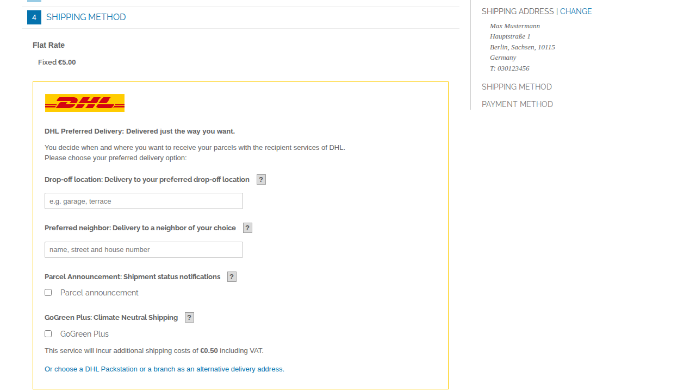
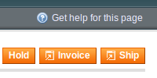
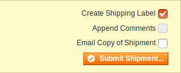
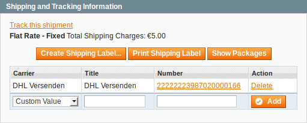
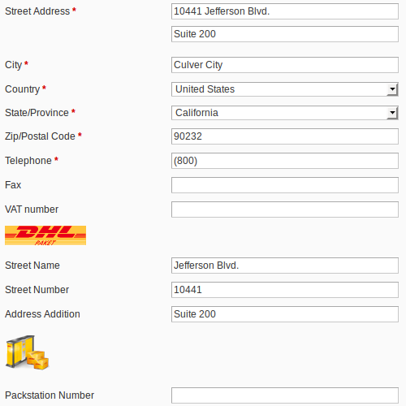

.. |date| date:: %Y-%m-%d
.. |year| date:: %Y

.. footer::
   .. class:: footertable

   +-------------------------+-------------------------+
   | Last updated: |date|    | .. class:: rightalign   |
   |                         |                         |
   |                         | ###Page###/###Total###  |
   +-------------------------+-------------------------+

.. header::
   .. image:: images/dhl.jpg
      :width: 4.5cm
      :height: 1.2cm
      :align: right

.. sectnum::

==================================================
DHL Versenden: Shipping for DHL Business Customers
==================================================

The module *DHL Versenden* (Shipping) for Magento® enables merchants with a DHL Business
Account to create shipments via the DHL Business Customer API (webservice) and
retrieve shipping labels. The extension also allows booking additional services
and creating the customs declaration for international shipping.

This document covers the **installation, configuration, and usage of the module
in Magento® 1**.

.. raw:: pdf

   PageBreak

.. contents:: End user documentation

.. raw:: pdf

   PageBreak

Requirements
============

The following requirements must be met for the smooth operation of the module:

Magento®
--------

The following Magento® versions are supported:

- Community Edition 1.9
- Community Edition 1.8
- Community Edition 1.7

PHP
---

These PHP versions are supported:

- PHP 7.2
- PHP 7.1
- PHP 7.0
- PHP 5.6
- PHP 5.5

To connect to the API (webservice), the PHP SOAP extension must be installed
and enabled on the web server.

Hints for using the module
==========================

Shipping origin and currency
----------------------------

This extension is intended for merchants located in Germany.
Make sure the shipment origin address (your shop address) is correct in the
three configuration sections mentioned in `Module configuration`_.

The base currency of the installation is assumed to be Euro. There is no conversion
from other currencies.

.. admonition:: Austria not supported

   Shipping from Austria (AT) is no longer supported.

   It is possible to complete existing orders in the system, but new orders
   cannot be processed via DHL if shipping from Austria.

Language support
----------------

The module supports the locales ``en_US`` and ``de_DE``. The translations are stored
in CSV translation files and can therefore be modified by third-party modules.

Third-Party module compability
------------------------------

Amazon Pay For Europe
~~~~~~~~~~~~~~~~~~~~~

The module is compatible with the extension *Creativestyle Amazon Pay For Europe*,
version **1.0.16** or higher.

To make sure the address is saved correctly, the following setting must be made in the
configuration of the Amazon Pay Module:

::

    System → Configuration → creativestyle → Amazon Pay → General Settings →
    Enable Login with Amazon → Yes

.. admonition:: Important

   This setting **must be enabled**, otherwise the address will not be saved correctly and
   therefore cannot be sent to DHL. The address would have to be edited manually later.

Data protection
---------------

The module transmits personal data to DHL which are needed to process the shipment (names,
addresses, phone numbers, email addresses, etc.). The amount of data depends on the
`Module configuration`_ as well as the booked `Additional Services In Checkout`_.

The merchant needs the agreement from the customer to process the data, e.g. via the shop's
terms and conditions and / or an agreement in the checkout (Magento® Checkout Agreements).

The data which is transmitted to the DHL Business Customer Shipping API can be seen in the
log ``var/log/dhl_versenden.log`` (see `General Settings`_ to enable this).

For `Additional Services In Checkout`_ (Parcel Management API), data will be logged in the
file ``var/log/dhl_service.log``. If no errors occur, nothing is logged.

.. raw:: pdf

   PageBreak

Installation and configuration
==============================

This section explains how to install and configure the module.

Installation
------------

Install the module's files according to your preferred setup / deployment strategy.
Refresh the configuration cache to apply the changes.

When the module is first executed, this new address attribute is created in
your system:

- ``dhl_versenden_info``

The attribute is added in the following tables:

- ``sales_flat_quote_address``
- ``sales_flat_order_address``

Module configuration
--------------------

There are three configuration sections which are relevant for creating shipments:

::

    System → Configuration → General → General → Store-Information
    System → Configuration → Sales → Shipping Settings → Origin
    System → Configuration → Sales → Shipping Methods → DHL Versenden

Make sure that the following required fields in the sections *Store Information*
and *Origin* are filled in completely:

* Store Information

  * Store Name
  * Store Contact Telephone

* Origin

  * Country
  * Region / State
  * ZIP / Postal Code
  * City
  * Street Address

* DHL Versenden (Shipping)

  * Contact data
  * Bank data

The sections *Shipping Methods → DHL* and *Shipping Methods → DHL (deprecated)*
are core parts of Magento® which connect to the webservice of DHL USA only.
They are not relevant for DHL Business Shipping (Versenden) in Germany.

**Do not enable those sections if you are using DHL Versenden (Shipping)!**

.. raw:: pdf

   PageBreak

General Settings
~~~~~~~~~~~~~~~~

Here you can choose if you want to run the module in **Sandbox Mode** to test the integration,
or in **production mode**.

You can also configure the **logging**. If the logging is enabled here **and**
in *System → Configuration → Advanced → Developer → Log Settings*, the communication with
the Busincess Customer Shipping API will be recorded in the file ``var/log/dhl_versenden.log``.
You can choose between three log levels:

* *Error*: Only record communication errors between the shop and the DHL webservice.
* *Warning*: Record communication errors and also errors related to the message
  content (e.g. address validation failed, invalid services selected).
* *Debug*: Record all errors, messages, and transferred content (label PDFs). **Recommended
  only for troubleshooting**.

.. admonition:: Notes about logging

   Make sure to clear or archive the log files regularly. The module does not delete the logs
   automatically. Personal data must only be stored as long as absolutely necessary.

   Log files:

   * ``var/log/dhl_versenden.log`` for label creation (Business Customer Shipping API)
   * ``var/log/dhl_service.log`` for additional DHL services (Parcel Management API)

Account Data
~~~~~~~~~~~~

The section *Account Data* holds your access credentials for the DHL webservice
which are required for production mode. Customers with a DHL contract will get
this information directly from the DHL team (Vertrieb DHL Paket).

A detailed tutorial for configuring the Participation Numbers (Teilnahmenummern) can
be found in `this article in the Knowledge Base <http://dhl.support.netresearch.de/support/solutions/articles/12000024659>`_.

.. raw:: pdf

   PageBreak

Shipment Orders
~~~~~~~~~~~~~~~

In the section *Shipment Orders*, the configuration for creating shipments via
the DHL webservice is made.

* *Print only if codeable*: If this is enabled, only shipments with perfectly
  valid addresses will be accepted by DHL. Otherwise, DHL will reject the shipment
  and issue an error message. If this option is disabled, DHL will attempt to
  correct an invalid address automatically, which results in an additional charge
  (Nachcodierungsentgelt). If the address cannot be corrected, DHL will still
  reject the shipment.
* *Send receiver phone number*: This controls if the buyer's phone number should be
  transmitted to DHL when creating the shipment. See also the notes about `Data protection`_.
* *Weight Unit*: Select if the product weights in your catalog are stored in
  gram or kilogram. If necessary, the weight will be converted to kilogram
  during transmission to DHL.
* *Shipping Methods for DHL Versenden*: Select which shipping methods should be
  linked to DHL Versenden. For shipping methods that are selected here, the available
  DHL services will be displayed in the checkout, and DHL labels will be created when
  creating the Magento® shipment.
* *Cash On Delivery payment methods for DHL Versenden*: Select which payment methods
  should be treated as Cash On Delivery (COD) payment methods. If one of these payment
  methods is used, a Cash On Delivery label will be created.

.. raw:: pdf

   PageBreak

Additional Services In Checkout
~~~~~~~~~~~~~~~~~~~~~~~~~~~~~~~

In the configuration section *Additional Services In Checkout* you can choose which
additional DHL services you want to offer to your customers.

Please also note the information about `Booking additional services`_ and
`Additional costs for services`_.

* *Enable Preferred Location*: The customer selects an alternative location where
  the shipment can be placed in case they are not at home.
* *Enable Preferred Neighbor*: The customer selects an alternative address in the
  neighborhood for the shipment in case they are not at home.
* *Enable Automatic Parcel Announcement*: The customer gets notified by email about the status
  of the shipment. The customer's email address will be transmitted to DHL for this service
  (note the section `Data protection`_). Select one of the following options:

  * *Yes*: The service will be booked.
  * *Enable on customers choice*: The customer decides in the checkout if the service should be booked.
  * *No*: The service will not be booked.

* *Enable Preferred Day*: The customer chooses a specific day on which the shipment
  should arrive. The available days are displayed dynamically, depending on the recipient's
  address.
* *Preferred day handling additional charge (handling fee)*: This amount will
  be added to the shipping cost if the service is used. Use a decimal point, not comma.
  The gross amount must be entered here (incl. VAT). If you want to offer the service
  for free, enter a ``0`` here.
* *Preferred day handling fee text*: This text will be displayed to the customer
  in the checkout if the service has been selected. You can use the placeholder ``$1``
  in the text which will show the additional handling fee and currency in the checkout.
* *Cut off time*: This sets the time up to which new orders will be dispatched on the
  same day. Orders placed *after* the cut off time will not be dispatched on the same
  day. The earliest possible preferred day will then be postponed by one day.

.. admonition:: Cut off time

   To make sure the time threshold works as expected, the server time needs to be set
   correctly. Check for any offsets due to daylight saving time or differing time
   zones. Adjust the cut off time setting to compensate, if needed.

.. raw:: pdf

   PageBreak

Automatic Shipment Creation
~~~~~~~~~~~~~~~~~~~~~~~~~~~

The section *Automatic Shipment Creation* lets you choose if shipments should be
created and package labels retrieved automatically (via Cronjob).

The setting *Notify Customer* allows to have the shipment confirmation email
sent to the customer if the shipment was created successfully.

You can also configure which *order status* an order must have to be processed
automatically. You can use this to exclude specific orders from being processed
automatically.

Shipment Defaults
~~~~~~~~~~~~~~~~~
The *additional services* which should be booked automatically can be chosen here.

Contact Data
~~~~~~~~~~~~

In the section *Contact Data* you configure the shipper (sender) data which should
be used when creating shipments with DHL.

Bank Data
~~~~~~~~~

In the section *Bank Data* you configure the bank account to be used for Cash On
Delivery (COD) shipments with DHL. The Cash On Delivery amount from the customer
will be transferred to this bank account.

Please note that you might also have to store the bank data in your DHL account.
Usually, this can be done through the DHL Business Customer Portal
(Geschäftskundenportal).

Return Shipment
~~~~~~~~~~~~~~~

In the section *Return Shipment* you configure the receiver address to be printed
on the Return Label, if that service was booked.

.. raw:: pdf

   PageBreak

Booking additional services
---------------------------

The available services as well as preferred days depend on the
actual shipping address and country. The DHL Parcel Management API is used for this
during the checkout process. Unusable services will be hidden in the checkout
automatically.

If the order contains articles which are not in stock, it won't be possible to book
preferred day.

The services *Preferred location* and *Preferred neighbor* cannot be booked together.

Additional costs for services
-----------------------------

The service *Preferred Day* is **enabled by default!**
Therefore the standard DHL handling fee will be added to the shipping cost.

When using the shipping method *Free Shipping* the additional handling fees will
always be ignored!

If you want to use the shipping method *Table Rates* and set a threshold for free
shipping, we recommend setting up a Shopping Cart Price Rule for this. By using this
shipping method the additional fees for DHL services will be included.

Tracking pixel for additional services
--------------------------------------

In case you'd like to offer preferred delivery options in your shop frontend, please note the following hint:

The extensions displays a tracking pixel in the checkout for reporting purposes. It
reports the URL on which the extension is used, as well as the number of extension
calls to DHL. No personal data is created and / or collected. The tracking pixel will
be displayed once every 30 days.

This function can be disabled here:

::

  System → Configuration → Checkout → DHL Versenden Tracking → No

Workflow and features
=====================

Creating an order
-----------------

The following section describes how the extension integrates itself into the order
process.

Checkout
~~~~~~~~

In the `module configuration`_ the shipping methods have been selected for which DHL
shipments and labels should be created. If the customer now selects one of those
shipping methods in the checkout, the configured additional services are offered.

In the checkout step *Payment information* the Cash On Delivery payment methods
will be disabled if Cash On Delivery is not available for the selected delivery
address.

The customer can click on the link "*Or as an alternative choose a shipment to
a Parcelstation or a Post Office*". This will lead the customer back to the checkout
step *Shipping address* to select a DHL location as shipping address, if desired.

If the module `DHL Locationfinder <http://dhl.support.netresearch.de/support/solutions/articles/12000023181>`_
is installed, the customer can use it to easily find nearby DHL pickup locations.

.. raw:: pdf

   PageBreak

Admin Order
~~~~~~~~~~~

When creating orders via the Admin Panel, no additional DHL services can be booked
while placing the order. However, it is possible to select services later when
creating the shipment.

The Cash On Delivery payment methods will be disabled if Cash On Delivery is not
available for the delivery address (same behaviour as in the checkout).

Please also note the information about `Booking additional services`_.

DHL Locationfinder (Packing Stations, Post Offices, Parcel Stations)
~~~~~~~~~~~~~~~~~~~~~~~~~~~~~~~~~~~~~~~~~~~~~~~~~~~~~~~~~~~~~~~~~~~~

The extension *DHL Versenden* only offers limited support for DHL delivery
addresses in the checkout:

* The format *Packstation 123* in the field *Street* will be recognized.
* The format *Postfiliale 123* in the field *Street* will be recognized.
* A numerical value in the field *Company* will be recognized as Post Number.

A more comprehensive support for creating shipments to DHL addresses via the
DHL webservice is offered by the separate extension `DHL Locationfinder
<http://dhl.support.netresearch.de/support/solutions/articles/12000023181>`_:

* Interactive map for selecting the DHL delivery address
* Separate fields for DHL data (e.g. post number)
* Validation of customer input
* Support for Parcel Stations (Paketshops)

Creating a shipment
-------------------

The following section explains how to create a shipment for an order and how
to retrieve the shipping label.

National shipments
~~~~~~~~~~~~~~~~~~

In the Admin Panel, select an order whose shipping method is linked to DHL (see
`Module configuration`_, section *Shipping Methods for DHL Versenden*). Then
click the button *Ship* on the top right of the page.

You will get to the page *New shipment for order*. Activate the checkbox
*Create shipping label* and click the button *Submit shipment...*.

Now a popup window for selecting the articles in the package will be opened. Click
the button *Add products*, select the products, and confirm by clicking
*Add selected product(s) to package*. The package dimensions are optional.

.. admonition:: Multipack shipments

   Splitting the products / items into multiple packages is currently not supported
   by the DHL webservice. As an alternative, you can create several shipments for
   one order (partial shipment), see also `this tutorial <http://dhl.support.netresearch.de/support/solutions/articles/12000029044>`_.

The button *OK* in the popup window is now enabled. When clicking it, the shipment
will be transmitted to DHL and (if the transmission was successful) a shipping
label will be retrieved. If there was an error, the message from the DHL webservice
will be displayed, and you can correct the data accordingly, see also Troubleshooting_.

International shipments
~~~~~~~~~~~~~~~~~~~~~~~

For shipments to addresses outside of the EU, additional fields will be displayed
in the popup window to define the articles in the package. To get the necessary
customs declaration, you have to enter at least the customs tariff number and
the content type.

Everything else is the same as described in the section `National shipments`_.

.. raw:: pdf

   PageBreak

Service selection
~~~~~~~~~~~~~~~~~

Aside from the services that can be selected by the customer in the checkout, there
are other services available for merchants in the DHL Business Portal
(Geschäftskundenportal). The available services for the current delivery address
are shown in the popup window for selecting the shipment articles.

.. image:: images/en/merchant_services.png
   :scale: 175 %

The services selected by the customer in the checkout will already be selected
here. Also, the service *Address validation* (Print only if codeable) will be
selected if enabled in the general `Module configuration`_.

Please note that the following inputs are **not** allowed for *Preferred location* and *Preferred neighbor*:

**Invalid special characters**

::

    < > \ ' " " + \n \r

**Invalid data**

* Paketbox
* Postfach
* Postfiliale / Postfiliale Direkt / Filiale / Filiale Direkt / Wunschfiliale
* Paketkasten
* DHL / Deutsche Post
* Packstation / P-A-C-K-S-T-A-T-I-O-N / Paketstation / Pack Station / P.A.C.K.S.T.A.T.I.O.N. /
  Pakcstation / Paackstation / Pakstation / Backstation / Bakstation / P A C K S T A T I O N

For shipments to DHL locations (Packstation, Post Offices, etc.) please use the appropriate address fields.

.. raw:: pdf

   PageBreak

Mass action
~~~~~~~~~~~

National and EU shipments and labels can be created using a mass action in the
order grid:

* Sales → Orders → Mass action *Create Shipping Labels*

This allows creating basic shipping labels with no further user interaction.
The following things apply:

* All order items will be added to the shipment.
* The DHL services selected during checkout will be booked.
* Additional services which are selected in the *Automatic Shipment Creation* section
  of the `Module configuration`_ will be added.

Shipment overview
-----------------

For orders that are processed by DHL, the order list will show DHL icons which
indicate the shipment status.

* **Crossed-out icon**: error during label creation, see Troubleshooting_.
* **Yellow icon**: transmission ok, label successfully created.
* **Gray icon**: transmission to DHL not executed yet.

.. image:: images/en/label_status.png
   :scale: 100 %

.. raw:: pdf

   PageBreak

Printing a shipping label
-------------------------

The successfully retrieved shipping labels can be opened in several locations
of the Admin Panel:

* Sales → Orders → Mass action *Print shipping labels*
* Sales → Shipments → Mass action *Print shipping labels*
* Detail page of a shipment → Button *Print shipping label*

Please note that this will not transmit *new* shipments to DHL, but only show
the DHL labels which are already stored in Magento®.

To create *new* DHL shipments and labels, please follow the instructions in the
section `Mass action`_.

Printing a return slip
----------------------

When shipping within Germany (DE → DE) it is possible to create a return slip together with
the shipping label.

Use the option *Return shipment* when requesting a label in the packaging popup.

To book this service, make sure the participation numbers for returns are properly configured:

* Retoure DHL Paket (DE → DE)

Canceling a shipment
--------------------

As long as a shipment has not been manifested, it can be canceled via the
DHL webservice. In the Admin Panel, open the detail page of a shipment and click
the link *Delete* in the box *Shipping and tracking information* next to the
tracking number.

If the shipment was canceled successfully, the tracking number and the
shipping label will be deleted from the system.

.. raw:: pdf

   PageBreak

Automatic shipment creation
---------------------------

The process for creating shipments manually can be too time-consuming or
cumbersome for merchants with a high shipment volume. To make this easier,
you can automate the process for creating shipments and transmitting them to
DHL. Enable the automatic shipment creation in the `Module configuration`_ and
select which services should be booked by default (in addition to those selected
by the customer in the checkout).

.. admonition:: Note

   The automatic shipment creation requires setting up Cron Jobs.

   ::

      # m h dom mon dow user command
      */15 * * * * /bin/sh /absolute/path/to/magento/cron.sh

Every 15 minutes the DHL extension will collect all orders which are ready for
shipping (according to the configuration), create shipments, and transmit them
to DHL. The automatic mode will not include shipments that require customs
declarations.

If you want to change the timing for the automatic shipment creation, or you need
a better monitoring of the execution, you can install the extension `Aoe_Scheduler`_.

.. _Aoe_Scheduler:  https://github.com/AOEpeople/Aoe_Scheduler

.. raw:: pdf

   PageBreak

Troubleshooting
---------------

Shipment creation
~~~~~~~~~~~~~~~~~

During the transmission of shipments to DHL, errors can occur. These are often
caused by an invalid address or an invalid combination of additional services.

When creating shipments manually, the error message will be directly visible.
Errors that occur during automatic shipment creation will be logged as order
comments. If the logging is enabled in the module configuration, you can also
check the shipments in the module's log file.

.. admonition:: Note

   When using the automatic shipment creation, make sure to regularly check
   the status of your orders to prevent the repeated transmission of invalid
   shipment requests to DHL.

Erroneous shipment requests can be corrected as follows:

* In the popup window for selecting the package articles, you can disable
  invalid additional services.
* In the popup window for selecting the package articles, you can disable the
  address validation. DHL will then attempt to correct an invalid address, which
  will result in an additional charge.
* On the detail page of the order or shipment, you can edit the receiver address
  and correct any errors. Use the link *Edit* in the box *Shipping address*.

  .. image:: images/en/edit_address_link.png
     :scale: 60 %

  On this page, you can edit the address fields in the upper part, and the special
  fields for DHL shipping in the lower part:

  * Street, House number, and address addition
  * Packstation number
  * Postfilial number (Post office)
  * Parcel shop number

Afterwards, save the address. If the error has been corrected, you can retry
`Creating a shipment`_.

If a shipment has already been transmitted successfully via the webservice, but
you want to make changes afterwards, please cancel the shipment first as described
in the section `Canceling a shipment`_. Then click *Create shipping label...*
inside the same box *Shipping and tracking information*. From here on, the
process is the same as described in `Creating a shipment`_.

Addition DHL services
~~~~~~~~~~~~~~~~~~~~~

In case of problems with `Additional Services In Checkout`_ (e.g. preferred day), error messages will be
written to a separate log file. See the notes in chapter `General settings`_. The log contains information
for further troubleshooting.

Also note the hints about `Booking additional services`_.

.. raw:: pdf

   PageBreak

Uninstalling or disabling the module
====================================

To *uninstall* the module, follow these steps:

1. Delete all module files from your file system
2. Remove the address attributes mentioned in the section Installation_
3. Remove the module entry ``dhl_versenden_setup`` from the table ``core_resource``.
4. Remove all module entries ``carriers/dhlversenden/*`` from the table ``core_config_data``.
5. Flush the cache afterwards.

In case you only want to *disable* the module without uninstalling it, set the
node ``active`` in the file ``app/etc/modules/Dhl_Versenden.xml`` from **true**
to **false**.

Technical support
=================

In case of questions or problems, please have a look at the Support Portal
(FAQ) first: http://dhl.support.netresearch.de/

If the problem cannot be resolved, you can contact the support team via the
Support Portal or by sending an email to dhl.support@netresearch.de
